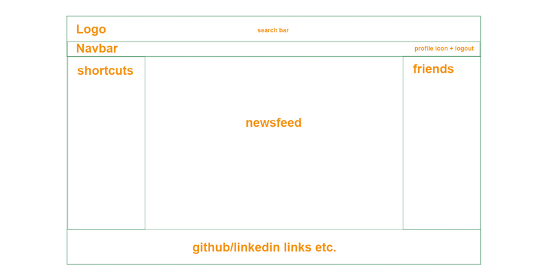
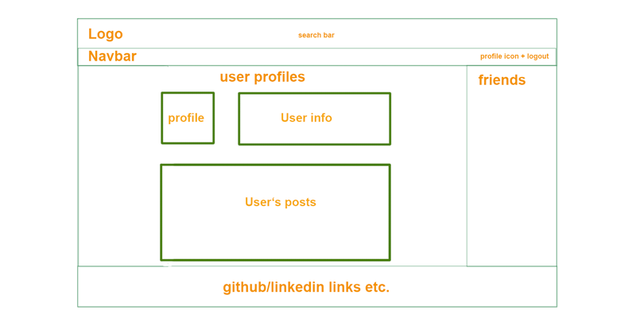

# FoodieGram

[FoodieGram](https://foodiegram-aa.herokuapp.com/)

## Background and Overview
FoodieGram is a social media app for foodies. Allows you to connect with friends and share your favorite restaurants in town. 

## Technologies and Technical Challenges

 ### Technologies:
+ MongoDB
+ Express
+ React
+ Node.js
+ Websockets
+ AWS
+ Google Maps API


### Technical challenges:
+ Learning websockets for live chat
+ Implementing an updating news feed 

## Functionality and MVPs

FoodieGram is a social media app built for foodies. Use it to follow your friends and other avid foodies on their food adventures around the city. Users will be able to interact with others through many different ways: Posts, likes, personal pages, events
### 1. Splash/ User Auth


### 2. Create your own profile page


### 3. News feed, make posts, tracked likes


### 4. Live chat with friends


- The following code below is for the livechat functionality backend for FoodieGram. This Code utilizes the Socket.io Library to send different actions including on connect, disconnect, addUser, and sending messages/getting messages

```
io.on("connection", (socket) => {
    socket.on("addUser", userId => {
        addUser(userId, socket.id);
        io.emit("getUsers", usersArr)
    });


    socket.on("sendMessage", ({ senderId, receiverId, text}) => {
        const user = getUser(receiverId);
        io.to(user.socketId).emit("getMessage", {
            senderId, 
            text,
        })
    })


    socket.on("disconnect", () => {
        removeUser(socket.id);
        socket.emit("getUsers", usersArr)
    });
});
```

### 5. Search bar for friends and restaurants


# Bonus: 
+ General groups for multi-purpose
+ Top foodies based on posts
+ Live map to reflect addresses from posts with descriptive pins

# Group Members:
1. Anuj P Gupta
2. Sonja Ng
3. Andy Yu
4. Jason Chu


# Work Breakdown:
1. Splash/Auth (collective baseline before branching)
- All work together (1/17-1/18)
2. Profile Pages 
Jason/Andy (1/18)
3. News feed, posts, tracked likes (Andy/ Sonja/Jason)
6. Live Chat (Anuj)
7. Search Bar (Jason)

Bonus:
Live map, Groups, Top foodies leaderboard

# Wireframe:



